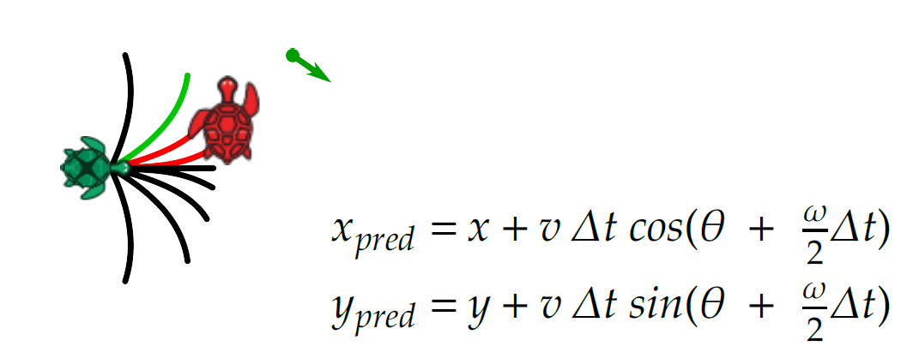

# Level 0: ROS2 Turtlesim Assignment Pratik

## Overview
In this assignment, you'll extend the functionalities of the ROS2 turtlesim package by introducing the turtle to autonomous navigation. Step-by-step instructions for building the same are given below:

### Deadline & submissions
1. Three days from the time you accept the assignment.
2. To submit your code, simply commit and push to your GitHub repository online. You can commit any number of times before your deadline.

## Instructions
The assignment is divided into three sections. The first two sections are related to odometry and it's visualization in TFs. The last, but most important section, reads the instructions for setting up autonomy on the turtle.

### 1. Custom odometry source:
- The turtlesim package by itself does not publish any odometry information. Instead, it has a topic called /turtle1/pose (turtlesim/msg/Pose type).
- Convert this pose to nav_msgs/msg/Odometry type and publish this to a new topic called /turtle1/odom (for example).

    Note: Make sure to include the correct header stamp:
    ```python
    header.frame_id = "odom"
    header.stamp = self.get_clock().now().to_msg()
    ```
    and it's child frame "base_link".

### 2. TF broadcasters
- Your odometry node should also broadcast the TF transform between "odom" and it's child frame "base_link".
- And a static TF between "map" and "odom" with translation/offset of (x=5.5, y=5.5) and the same orientation as "odom". (The rviz2 grid should
correspond to the area of the simulator with 11 cells)

### 3. Turtle autonomy

We want the robot to autonomously navigate to a specified goal position. To achieve this, implement a ROS node that subscribes to the robot's current pose (x,y,θ) and the goal pose (published to /goal_pose, e.g., via rviz2).

The turtle is an example of a **unicycle model** (robots with two degrees of mobility, i.e., velocity in it's X-axis and orientation in it's Z-axis), and the model equations for the same are given in the image above.

Develop a function that generates multiple predictions of the robot's future position for various yaw rates (ω), using a constant time step (Δt) and a constant speed (v). For each prediction, estimate the robot's future position (xpred,ypred) and select the yaw rate that brings the robot closest to the goal.

(Optional but recommended) Create a launch file to start this node, allowing v and Δt to be set as ROS parameters.

#### Optional: **Service for obstacle awareness**

Add multiple robots using the /spawn service.

Assume the navigation node cannot directly perceive obstacles (other robots), but an external infrastructure can detect all robots and communicate their positions via a server. Implement a server node that subscribes to the poses of all other robots (you may test with just one additional robot).

The navigation node should then act as a client, requesting the positions of other robots from the server. Update your navigation logic to avoid predicted positions that are too close to another robot.

## Deliverables
- A ROS2 package containing:
  1. A node for publishing odometry data (`/turtle1/odom`).
  2. A TF broadcaster for the required transforms.
  3. Nodes implementing the turtle's autonomous navigation logic.

- A `README.md` file with:
  1. Instructions to build and run your package.
  2. A brief explanation of your approach to the assignment.

- A launch file (optional but recommended) to:
  1. Start the turtlesim simulator.
  2. Launch your odometry and TF broadcaster nodes.
  3. Launch your autonomous navigation nodes.

- A short video (optional but recommended) demonstrating:
  1. The turtle's movement in the simulator.
  2. Visualization of odometry and TF frames in `rviz2`.
